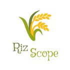
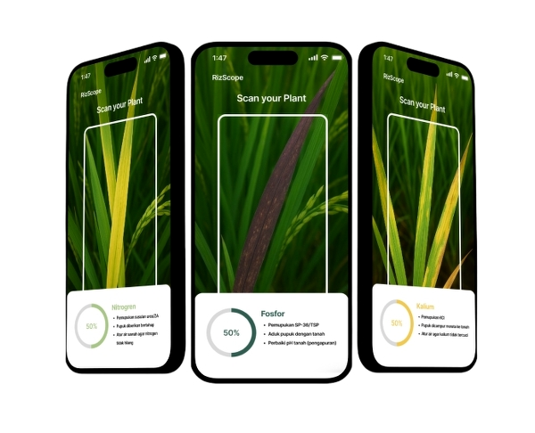

# AI-RizScope

[](https://github.com/FranklinJaya2006/AI-RizScope/graphs/contributors)

[](https://www.linkedin.com/in/franklin-jaya-6a3697364/) [](https://www.linkedin.com/in/chaidenfoanto/?locale=en)

[contributors-shield]: https://img.shields.io/github/contributors/FranklinJaya2006/AI-RizScope.svg?style=for-the-badge]

[linkedin-shield]: https://img.shields.io/badge/LinkedIn-0A66C2?style=for-the-badge&logo=linkedin&logoColor=white

<!-- PROJECT LOGO --> 
<p align="center">
  
</p>
<br />

<!-- TABLE OF CONTENTS -->
<details>
  <summary>Table of Contents</summary>
  <ol>
    <li>
      <a href="#about-the-project">About The Project</a>
      <ul>
        <li><a href="#built-with">Built With</a></li>
        <li><a href="#project-dependencies">Project Dependencies</a></li>
      </ul>
    </li>
    <li>
      <a href="#publication">Publication</a>
      <ul>
        <li><a href="#research-title">Research Title</a></li>
        <li><a href="#research-overview">Research Overview</a></li>
        <li><a href="#research-contributions">Research Contributions</a></li>
        <li><a href="#publication-link">Publication Link</a></li>
      </ul>
    </li>
    <li>
      <a href="#getting-started">Getting Started</a>
      <ul>
        <li><a href="#prerequisites">Prerequisites</a></li>
        <li><a href="#installation">Installation</a></li>
        <li><a href="#build-apk">Build APK</a></li>
      </ul>
    </li>
    <li>
      <a href="#usage">Usage</a>
    </li>
    <li>
      <a href="#contact">Contact</a>
    </li>
    <li>
      <a href="#development-team">Development Team</a>
    </li>
  </ol>
</details>


<!-- ABOUT THE PROJECT -->
## About The Project

<p align="center">
  
</p>

AI-RizScope is an intelligent agriculture application developed using Unity and Roboflow Computer Vision technology to help farmers identify nutrient deficiencies in rice plants through smartphone cameras.

The application analyzes plant leaf conditions in real time and classifies nutrient deficiency symptoms such as Nitrogen (N), Phosphorus (P), and Potassium (K) deficiencies. Based on the detected condition, the system provides recommendations and treatment suggestions to support crop health and productivity.

Main features include:

- Real-time plant nutrient deficiency detection
- Camera-based leaf scanning
- AI-powered image classification using Roboflow
- Nitrogen (N) deficiency identification
- Phosphorus (P) deficiency identification
- Potassium (K) deficiency identification
- AI-generated recommendations
- Mobile-friendly interface built with Unity
- Agricultural decision support system

<p align="right">(<a href="#readme-top">back to top</a>)</p>

### Built With

This game project was developed using the following technologies:

[](#) [](#) [](https://developer.vuforia.com/) [](#)

<p align="right">(<a href="#readme-top">back to top</a>)</p>

### Project Dependencies

This project uses several Unity packages and supporting libraries:

- Unity 6 (6000.2.2f1)
- C#
- Roboflow
- Computer Vision
- Android SDK

<p align="right">(<a href="#readme-top">back to top</a>)</p>

## Getting Started

Follow these steps to set up the unity project locally

### Prerequisites

Make sure you have installed the following software:

- Unity Hub
- Unity Editor 6 (6000.2.2f1)
- Android Build Support
- Github
- Roboflow Account
- Android Device (for testing)

Check your installation:

```sh
git --version
```

You can verify the Unity version directly from Unity Hub.

---

### Installation

1. Clone the repository

```sh
git clone https://github.com/your_username/AI-RizScope.git
```

2. Navigate to the project folder

```sh
cd AI-RizScope
```

3. Open the project using Unity Hub

- Open Unity Hub
- Click **Add Project**
- Select the cloned project folder

4. Install required Unity packages

Open:

```txt
Window → Package Manager
```

Make sure these packages are installed:

- Unity Web Request
- Android Build Support

5. Configure Roboflow API

Open the project configuration file and replace the API Key with your own Roboflow API Key.

```txt
Roboflow API Key
Project Endpoint
Model Version
```

6. Configure Android Build Support

Open:

```txt
File → Build Settings
```

Then select:

```txt
Android → Switch Platform
```

7. Run the project

Press the **Play** button inside the Unity Editor.

---

### Build APK

To generate an Android APK:

```txt
File → Build Settings → Build
```

The generated APK can then be installed on Android devices for field testing and plant nutrient analysis.

---

## Usage

AI-RizScope is a mobile-based intelligent agriculture application that utilizes Computer Vision and Artificial Intelligence to identify nutrient deficiencies in rice plants.

The application uses smartphone cameras and Roboflow AI models to analyze plant leaf conditions and provide recommendations based on detected nutrient deficiencies.

Main features include:

- Real-time rice leaf analysis
- AI-powered nutrient deficiency detection
- Nitrogen deficiency identification
- Phosphorus deficiency identification
- Potassium deficiency identification
- Healthy plant classification
- AI-generated recommendations
- Mobile-based plant monitoring
- Camera integration with Unity

System workflow:

1. Users open the AI-RizScope application
2. Users capture an image of a rice plant leaf
3. The image is processed and sent to the Roboflow AI model
4. The AI model analyzes the plant condition
5. The system identifies the detected nutrient status
6. AI generates recommendations and treatment suggestions
7. Results are displayed directly within the application
8. Users can use the recommendations for crop management decisions


<p align="right">(<a href="#readme-top">back to top</a>)</p>

<!-- CONTACT -->
## Contact

- Franklin Jaya - [@franklinjaya_](https://www.instagram.com/franklinjaya_/) - franklinjaya827@gmail.com - [Franklin-Github](https://github.com/FranklinJaya2006) <br>


<p align="right">(<a href="#readme-top">back to top</a>)</p>

## Development Team

This Project are developed by **Replika-Go Development Team**, which consist of five people:

1. **Alicia Lisal**
2. **Alvin Yuga Pramana**

<!-- MARKDOWN LINKS & IMAGES -->
<!-- https://www.markdownguide.org/basic-syntax/#reference-style-links -->
[Laravel.com]: https://img.shields.io/badge/Laravel-%23FF2D20.svg?logo=laravel&logoColor=white
[Laravel-url]: https://laravel.com
